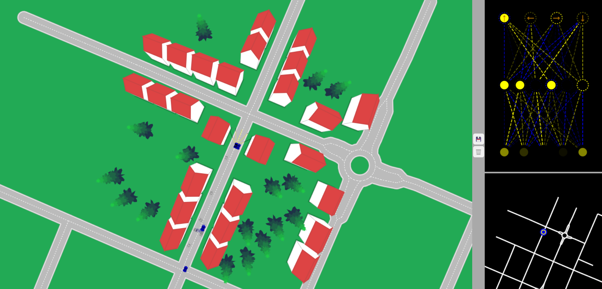

# VirtualWorld.js: A Dynamic Virtual Environment with Intelligent Road Systems

VirtualWorld.js is an innovative project crafted entirely in vanilla JavaScript, showcasing the power of web technologies to create a dynamic and immersive virtual world. This project introduces manually generated roads using spatial graphs or dynamically generated from OpenStreetMaps data, offering users the flexibility to shape their virtual landscapes. Explore the endless possibilities of urban planning, traffic management, and autonomous vehicle testing in this feature-rich VirtualWorld.js project, where the boundaries between the virtual and real world blur into an engaging and interactive experience.



<!-- TABLE OF CONTENTS -->
<details>
  <summary>Table of Contents</summary>
  <ol>
    <li>
      <a href="#about-the-project">About The Project</a>
    </li>
    <li>
      <a href="#getting-started">Getting Started</a>
      <ul>
        <li><a href="#installation">Installation</a></li>
      </ul>
    </li>
    <li><a href="#features">Features</a></li>
    <li><a href="#contributing">Contributing</a></li>
    <li><a href="#license">License</a></li>
    <li><a href="#view-demo">View Demo</a></li>
    <li><a href="#contact">Contact</a></li>
  </ol>
</details>

## Getting Started

### Installation

_Follow the following steps to install and setup the virtual environment._

1. Clone the repo
   ```sh
   git clone https://github.com/Samrat-14/virtual-world.git
   ```
2. And done! You can get started with the project. Run the index.html with live server.

## Features

- **Road Generation and Customization:** Users can manually design roads using spatial graphs or leverage OpenStreetMaps data for automatic road generation. This feature empowers creators to craft intricate and realistic road networks within the virtual environment.
- **Intelligent Building and Tree Generation:** Buildings and trees are intelligently generated within the virtual world, enhancing the realism of the environment. The system intelligently places structures based on predefined rules, creating a visually compelling and diverse landscape.
- **Markings Editor for Traffic Management:** VirtualWorld.js includes a markings editor, allowing users to add traffic lights, stop signs, and other essential road markings. This feature enables fine-tuning of the virtual traffic infrastructure, enhancing the simulation's accuracy and realism.
- **Integration of Self-Driving Cars:** Leveraging the self-driving car project's capabilities, intelligent cars are seamlessly integrated into the virtual world. These vehicles navigate through the roads autonomously, responding to traffic signals, stop signs, and dynamic obstacles, providing a realistic and interactive experience.
- **Interactive and Collaborative Environment:** VirtualWorld.js promotes interactivity and collaboration, allowing multiple users to explore and interact within the virtual environment simultaneously. Real-time changes made by one user are reflected for others, fostering a shared experience in this dynamically evolving virtual world.

## Contributing

I love contributions, so please feel free to fix bugs, improve things, provide documentation.
If you have a suggestion that would make this better, please fork the repo and create a pull request. You can also simply open an issue with the tag "enhancement".
Don't forget to give the project a star! Thanks again!

1. Fork the Project
2. Create your Feature Branch (`git checkout -b feature/AmazingFeature`)
3. Commit your Changes (`git commit -m 'Add some AmazingFeature'`)
4. Push to the Branch (`git push origin feature/AmazingFeature`)
5. Open a Pull Request

<!-- LICENSE -->

## License

Distributed under the MIT License. See `LICENSE` for more information.

## View Demo

Live Demo: [https://samrat-14.github.io/virtual-world/](https://samrat-14.github.io/virtual-world)

## Contact

Your Name - [Samrat Sadhu](https://samrat-sadhu-portfolio.vercel.app/) - ss2414@ece.jgec.ac.in
